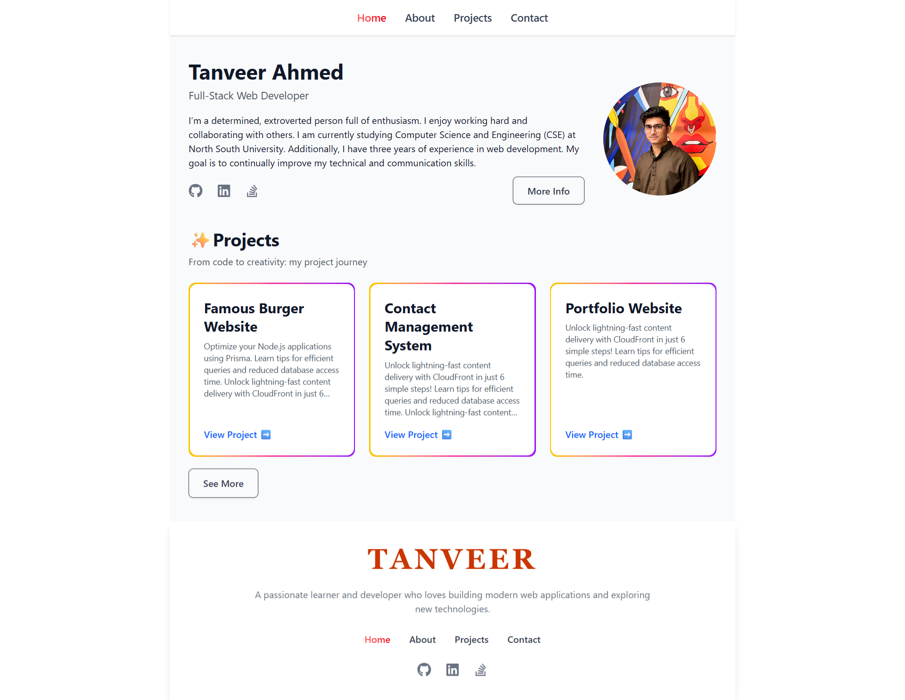
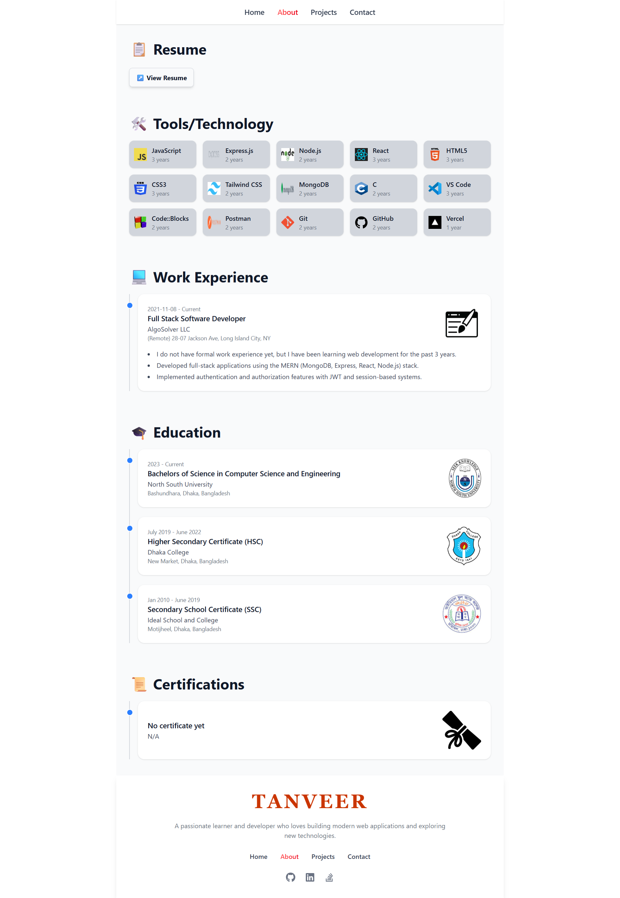
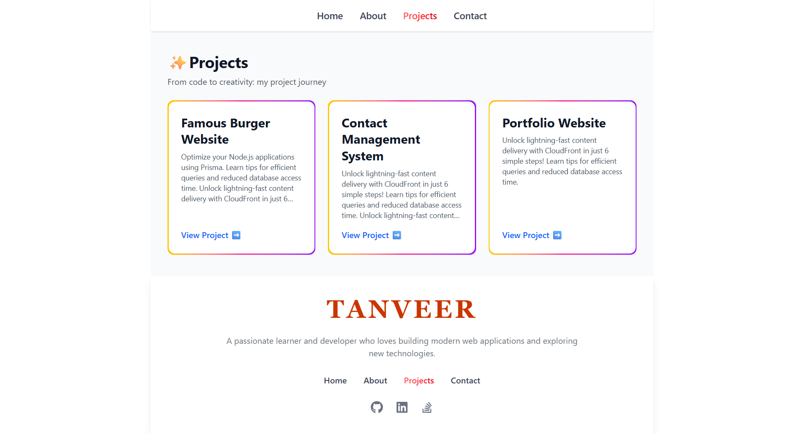
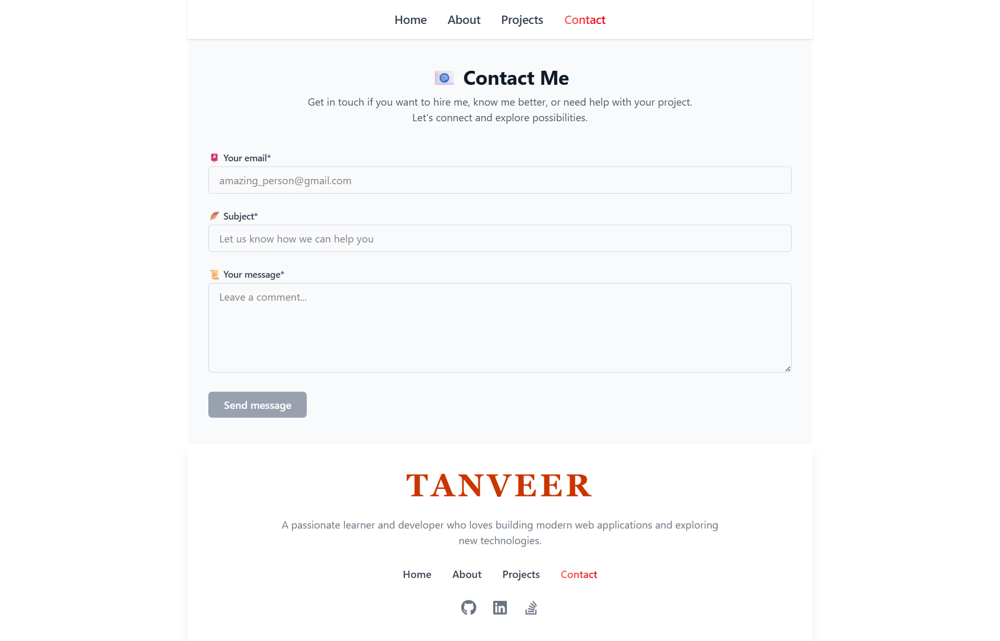

# 👨‍💻 Personal Portfolio – Tanveer Ahmed


---

🌐 **Live Demo**: [https://tanveer-ahmed.vercel.app](https://tanveer-ahmed.vercel.app)

A professional personal portfolio website showcasing **projects, skills, experience, and contact information**. This project demonstrates **responsive design, project showcase, interactive UI, and contact integration**.

---


## 📑 Table of Contents

- [🚀 Features](#-features)
- [📝 Problems & Solutions](#-problems--solutions)
- [🛠 Tech Stack](#-tech-stack)
- [📸 Screenshots](#-screenshots)
- [⚙️ Installation & Setup](#installation-and-setup)
- [📡 API Endpoints](#-api-endpoints)
- [🌍 Deployment](#-deployment)
- [📌 Future Improvements](#-future-improvements)
- [👤 Author](#-author)

---

## 🚀 Features

- 🏠 **Home Page** – Introduction and professional summary  
- 💼 **Projects Showcase** – Display of projects with descriptions and links  
- 📝 **Resume Section** – Downloadable resume 
- 📬 **Contact Form** – Users can send messages directly from the website  
- 📱 **Responsive Design** – Optimized for desktop, laptop, and mobile using **Tailwind CSS** 
- 🌐 **Deployment** – Hosted on Vercel

---

## 📝 Problems & Solutions

During the development of this project, I faced several challenges and found solutions for each:

1. **Problem:** Messages were not being sent through the live Vercel deployment.  
   **Solution:** The issue was caused by outdated environment variables on Vercel. After updating the environment variables, it was necessary to redeploy the project for the changes to take effect. Once redeployed, the messaging functionality worked correctly.

2. **Problem:** Responsive design and cross-device compatibility.  
   **Solution:** Used Tailwind CSS to make all components responsive and tested on multiple screen sizes.

---

## 🛠 Tech Stack  

| Stack | Technologies |
| :-- | :-- |
| **Frontend** |      |
| **Backend / API** |   |
| **Database** |  |
| **Email / Communication** |  |
| **Deployment / Hosting** |  |

---

## 📸 Screenshots

**Home Page:**  
  

**About Page:**  
  

**Projects Page:**  
  

**Contact Page:**  


---

## Installation and Setup

1. **Clone the repo**

    ```bash
    git clone https://github.com/tanveera2001/my-portfolio-website.git
    cd my-portfolio-website

    ```
2. **Set up environment variables**
   ```bash
    SERVER_PORT=5000
    MONGODB_ATLAS_URL=your_mongodb_connection_string
    JWT_SECRET=your_jwt_secret_key
    NODE_ENV=development
    MAIL_HOST=your_mailtrap_host
    MAIL_PORT=587
    MAIL_USER=your_mailtrap_username
    MAIL_PASS=your_mailtrap_password
    FRONTEND_URL=http://localhost:5173

   ```

3. **Install dependencies**

   - **Backend:**  
     Go to the **frontend** folder and run:
     ```bash
     npm install
     ```
     
   - **Frontend:**  
     Go to the **backend** folder and run:
     ```bash
     npm install
     ```

4. **Run the development server**

   - **Backend:**  
    In the **backend** folder, run:
     ```bash
     npm run dev
     ```
     
   - **Frontend:**  
     In the frontend folder, run:
     ```bash
     npm run dev
     ```


5. Open the app in your browser at:

    ```
    http://localhost:5173
    ```

---

## 📡 API Endpoints

| Method | Endpoint                        | Description |
| ------ | ------------------------------- | ----------- |
| GET    | /api/projects                   | Get all projects |
| GET    | /api/tools-technologies         | Get all tools & technologies |
| GET    | /api/education                  | Get all education entries |
| GET    | /api/work-experience            | Get all work experiences |
| GET    | /api/certifications             | Get all certifications |
| POST   | /api/contact                    | Submit contact form |
| GET    | /api/seed/projects              | Seed project data |
| GET    | /api/seed/tools-technologies    | Seed tools & technologies data |
| GET    | /api/seed/education             | Seed education data |
| GET    | /api/seed/work-experience       | Seed work experience data |
| GET    | /api/seed/certifications        | Seed certifications data |


---

## 🌍 Deployment

🌐 **Live Demo**: [https://tanveer-ahmed.vercel.app](https://tanveer-ahmed.vercel.app)

---

## 📌 Future Improvements

- ✅ Dark / Light mode toggle  
- ✅ Multi-language support  
- ✅ Animation & interactive UI elements  
- ✅ Blog / Articles section  

---

## 👤 Author

**[Tanveer Ahmed]**

- 📧 Email: [tanveera2001@gmail.com](mailto:tanveera2001@gmail.com)  
- 💼 LinkedIn: [https://www.linkedin.com/in/md-tanveer-ahmed-23b06023b/](https://www.linkedin.com/in/md-tanveer-ahmed-23b06023b/)  
- 💻 GitHub: [https://github.com/tanveera2001](https://github.com/tanveera2001)
